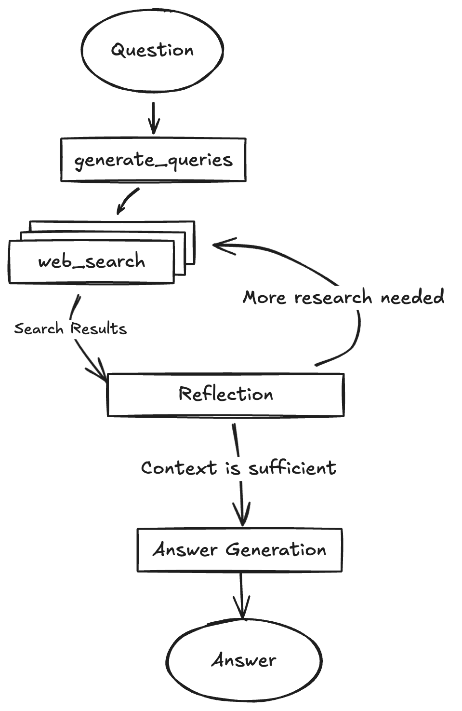

# Local_Gemini_Deep_Research
Modifying the newly released deep research code so that its reliant on local LLM. Note it still uses google search API.


This project is a modification of the original Gemini Fullstack LangGraph Quickstart by Google Gemini Authors. It has been adapted to run the Language Model (LLM) portions fully locally using LM Studio, which provides an OpenAI-compatible API endpoint.

The core application structure, featuring a React frontend and a LangGraph-powered backend agent, remains. The agent is designed to perform comprehensive research on a user's query by dynamically generating search terms, querying the web, reflecting on the results, and iteratively refining its search to provide a well-supported answer. This modified version demonstrates how to adapt such an architecture for local LLM inference.


This work is based on and significantly adapts the:

Gemini Fullstack LangGraph Quickstart: https://github.com/google-gemini/gemini-fullstack-langgraph-quickstart
I extend My gratitude to the original authors for providing an excellent foundation.

```bashKey Modifications for Local LLM Execution

The primary changes in this version are:
•	LLM Backend: Switched from relying on Google Gemini APIs to using a local LLM served via LM Studio (through its OpenAI-compatible API). This involves using langchain-openai's ChatOpenAI client.
•	Environment Configuration: Updated to support LM Studio's API base URL and local model identifiers. The GEMINI_API_KEY is no longer strictly required for the LLM parts but might be needed if you configure specific LangChain tools that use Google services (like Google Search tools).
•	Web Search & Summarization: The direct integration with google.genai.Client for web search and its grounding metadata has been replaced. The agent now uses generic LangChain search tools (e.g., DuckDuckGoSearchRun as an example) and a local LLM for summarizing search results.
•	Citation Mechanism: Due to the change in the web search mechanism and the absence of Google's specific grounding_metadata, the detailed citation generation and injection have been simplified. Source attribution now relies more on the LLM's ability to incorporate source URLs from search results into its summaries, or a basic listing of found URLs.
Features (Adapted for Local LLM)
•	💬 Fullstack application with a React frontend and LangGraph backend.
•	🧠 Powered by a LangGraph agent for advanced research and conversational AI, using a local LLM via LM Studio.
•	🔍 Dynamic search query generation using your local LLM.
•	🌐 Web research via generic LangChain tools (e.g., DuckDuckGo), with summarization by your local LLM.
•	🤔 Reflective reasoning to identify knowledge gaps and refine searches, performed by your local LLM.
•	📄 Generates answers based on synthesized information, with simplified source attribution.
•	🔄 Hot-reloading for both frontend and backend development.


Project Structure
The project is divided into two main directories:
•	frontend/: Contains the React application built with Vite.
•	backend/: Contains the LangGraph/FastAPI application, including the research agent logic.
Getting Started: Development with LM Studio (Local LLM)
Follow these steps to get the application running locally with LM Studio.
1. Prerequisites:
•	LM Studio: Download and install from lmstudio.ai.
•	Node.js and npm (or yarn/pnpm)
•	Python 3.8+
2. LM Studio Setup:
•	Launch LM Studio.
•	Download a model compatible with the OpenAI API format (most GGUF models work well).
•	Go to the "Local Server" tab (typically looks like <-->).
•	Select your downloaded model from the dropdown.
•	Click "Start Server". By default, it runs on http://localhost:1234. Note the model identifier shown in LM Studio (e.g., gemini3.27b or a simpler alias you might set).
3. Clone This Modified Repository:
      git clone <url_of_this_modified_repository>
cd <repository_name>
    
4. Backend Setup:
•	Navigate to the backend/ directory.
•	Its defaulted to lmstudio.Create a file named .env by copying the backend/.env.example file:
•	      cp .env.example .env
    
IGNORE_WHEN_COPYING_START
content_copy download 
Use code with caution. Bash
IGNORE_WHEN_COPYING_END
•	Open the .env file and configure it for LM Studio:
•	      # For LM Studio (typically no API key needed by default)
•	OPENAI_API_BASE="http://localhost:1234/v1"
•	OPENAI_API_KEY="not_needed" # Or any string if your LM Studio server requires one
•	
•	# --- Local Model Names ---
•	# These should match the model identifier loaded in LM Studio.
•	# For simplicity, you can use the same model for all tasks,
•	# or specify different ones if you have multiple models loaded.
•	QUERY_GENERATOR_MODEL="your-lmstudio-model-identifier" # e.g., TheBloke/Mistral-7B-Instruct-v0.2-GGUF
•	SEARCH_LLM_MODEL="your-lmstudio-model-identifier"
•	REFLECTION_MODEL="your-lmstudio-model-identifier"
•	ANSWER_MODEL="your-lmstudio-model-identifier"
•	
•	# Optional: If using Google Search tools via LangChain (not genai_client directly)
•	# GOOGLE_API_KEY="your_google_api_key_for_search"
•	# GOOGLE_CSE_ID="your_google_custom_search_engine_id"
•	
•	# Optional: LangSmith API Key for tracing (highly recommended for debugging)
•	# LANGSMITH_API_KEY="YOUR_LANGSMITH_API_KEY"
    
IGNORE_WHEN_COPYING_START
content_copy download 
Use code with caution. Env
IGNORE_WHEN_COPYING_END
Replace "your-lmstudio-model-identifier" with the actual identifier of the model you loaded in LM Studio.
•	Install backend dependencies:
•	      cd backend
•	pip install .  # Or pip install -e . for editable install
    
IGNORE_WHEN_COPYING_START
content_copy download 
Use code with caution. Bash
IGNORE_WHEN_COPYING_END
5. Frontend Setup:
•	Navigate to the frontend/ directory:
•	      cd ../frontend # If you were in backend/
•	# or cd frontend from project root
    
IGNORE_WHEN_COPYING_START
content_copy download 
Use code with caution. Bash
IGNORE_WHEN_COPYING_END
•	Install frontend dependencies:
•	      npm install
    
IGNORE_WHEN_COPYING_START
content_copy download 
Use code with caution. Bash
IGNORE_WHEN_COPYING_END
6. Run Development Servers:
•	Ensure LM Studio Server is running.
•	Backend:
Open a terminal in the backend/ directory and run:
•	      langgraph dev
    
IGNORE_WHEN_COPYING_START
content_copy download 
Use code with caution. Bash
IGNORE_WHEN_COPYING_END
The backend API will typically be available at http://127.0.0.1:2024.
•	Frontend:
Open another terminal in the frontend/ directory and run:
•	      npm run dev
    
IGNORE_WHEN_COPYING_START
content_copy download 
Use code with caution. Bash
IGNORE_WHEN_COPYING_END
The frontend will typically be available at http://localhost:5173. Open this URL in your browser (it should be /app e.g. http://localhost:5173/app).
How the Backend Agent Works (with Local LLM)
The core agent flow is similar to the original, but LLM interactions are redirected:


(Agent flow diagram from the original project. The LLM steps now use your local model.)
1.	Generate Initial Queries: Based on your input, it generates a set of initial search queries using your local LLM via LM Studio.
2.	Web Research: For each query, it uses a generic LangChain search tool (e.g., DuckDuckGo) to find relevant web pages. The raw search results are then summarized by your local LLM via LM Studio.
3.	Reflection & Knowledge Gap Analysis: The agent analyzes the summarized search results to determine if the information is sufficient or if there are knowledge gaps. It uses your local LLM via LM Studio for this reflection.
4.	Iterative Refinement: If gaps are found, it generates follow-up queries and repeats the web research and reflection steps.
5.	Finalize Answer: Once sufficient, the agent synthesizes the gathered information into a coherent answer using your local LLM via LM Studio. Source attribution is simplified.
Deployment
The original project includes guidance for Docker deployment using Google Gemini and LangSmith. The provided docker-compose.yml in this repository is from the original project and is configured for that setup.
Deploying this modified version with a local LLM (like LM Studio) has different considerations:
•	If LM Studio runs on a host machine, the Dockerized backend would need network access to the LM Studio API endpoint.
•	For a fully containerized solution, you would need to package a local LLM inference engine (like llama.cpp, Ollama, etc.) within a Docker container, which is beyond the scope of this modified quickstart.
The apiUrl in frontend/src/App.tsx is set for development (http://localhost:2024) or a specific Docker setup (http://localhost:8123 as in the original docker-compose.yml). Adjust this if your deployment targets a different backend URL.
Technologies Used
•	React (with Vite) - For the frontend.
•	Tailwind CSS & Shadcn UI - For styling and components.
•	LangGraph - For building the backend agent.
•	Local LLM via LM Studio - For all LLM-based tasks (query generation, reflection, answer synthesis, summarization).
•	LangChain OpenAI (ChatOpenAI) - To interact with the LM Studio OpenAI-compatible API.
•	LangChain Community Tools (e.g., DuckDuckGoSearchRun) - For web searching.
```

Acknowledgements

•	This project is a direct modification of the Gemini Fullstack LangGraph Quickstart by the Google Gemini Authors. Their original work provided the complete structure and a significant portion of the codebase.

•	LM Studio for providing an easy way to run local LLMs with an OpenAI-compatible API.

•	The LangChain and LangGraph teams for their powerful open-source libraries.

License

This project is licensed under the Apache License 2.0. See the LICENSE file for details (inherited from the original project).


# Original Instructions Gemini Fullstack LangGraph Quickstart

This project demonstrates a fullstack application using a React frontend and a LangGraph-powered backend agent. The agent is designed to perform comprehensive research on a user's query by dynamically generating search terms, querying the web using Google Search, reflecting on the results to identify knowledge gaps, and iteratively refining its search until it can provide a well-supported answer with citations. This application serves as an example of building research-augmented conversational AI using LangGraph and Google's Gemini models.


## Features

- 💬 Fullstack application with a React frontend and LangGraph backend.
- 🧠 Powered by a LangGraph agent for advanced research and conversational AI.
- 🔍 Dynamic search query generation using Google Gemini models.
- 🌐 Integrated web research via Google Search API.
- 🤔 Reflective reasoning to identify knowledge gaps and refine searches.
- 📄 Generates answers with citations from gathered sources.
- 🔄 Hot-reloading for both frontend and backend development during development.

## Project Structure

The project is divided into two main directories:

-   `frontend/`: Contains the React application built with Vite.
-   `backend/`: Contains the LangGraph/FastAPI application, including the research agent logic.

## Getting Started: Development and Local Testing

Follow these steps to get the application running locally for development and testing.

**1. Prerequisites:**

-   Node.js and npm (or yarn/pnpm)
-   Python 3.8+
-   **`GEMINI_API_KEY`**: The backend agent requires a Google Gemini API key.
    1.  Navigate to the `backend/` directory.
    2.  Create a file named `.env` by copying the `backend/.env.example` file.
    3.  Open the `.env` file and add your Gemini API key: `GEMINI_API_KEY="YOUR_ACTUAL_API_KEY"`

**2. Install Dependencies:**

**Backend:**

```bash
cd backend
pip install .
```

**Frontend:**

```bash
cd frontend
npm install
```

**3. Run Development Servers:**

**Backend & Frontend:**

```bash
make dev
```
This will run the backend and frontend development servers.    Open your browser and navigate to the frontend development server URL (e.g., `http://localhost:5173/app`).

_Alternatively, you can run the backend and frontend development servers separately. For the backend, open a terminal in the `backend/` directory and run `langgraph dev`. The backend API will be available at `http://127.0.0.1:2024`. It will also open a browser window to the LangGraph UI. For the frontend, open a terminal in the `frontend/` directory and run `npm run dev`. The frontend will be available at `http://localhost:5173`._

## How the Backend Agent Works (High-Level)

The core of the backend is a LangGraph agent defined in `backend/src/agent/graph.py`. It follows these steps:


1.  **Generate Initial Queries:** Based on your input, it generates a set of initial search queries using a Gemini model.
2.  **Web Research:** For each query, it uses the Gemini model with the Google Search API to find relevant web pages.
3.  **Reflection & Knowledge Gap Analysis:** The agent analyzes the search results to determine if the information is sufficient or if there are knowledge gaps. It uses a Gemini model for this reflection process.
4.  **Iterative Refinement:** If gaps are found or the information is insufficient, it generates follow-up queries and repeats the web research and reflection steps (up to a configured maximum number of loops).
5.  **Finalize Answer:** Once the research is deemed sufficient, the agent synthesizes the gathered information into a coherent answer, including citations from the web sources, using a Gemini model.

## Deployment

In production, the backend server serves the optimized static frontend build. LangGraph requires a Redis instance and a Postgres database. Redis is used as a pub-sub broker to enable streaming real time output from background runs. Postgres is used to store assistants, threads, runs, persist thread state and long term memory, and to manage the state of the background task queue with 'exactly once' semantics. For more details on how to deploy the backend server, take a look at the [LangGraph Documentation](https://langchain-ai.github.io/langgraph/concepts/deployment_options/). Below is an example of how to build a Docker image that includes the optimized frontend build and the backend server and run it via `docker-compose`.

_Note: For the docker-compose.yml example you need a LangSmith API key, you can get one from [LangSmith](https://smith.langchain.com/settings)._

_Note: If you are not running the docker-compose.yml example or exposing the backend server to the public internet, you update the `apiUrl` in the `frontend/src/App.tsx` file your host. Currently the `apiUrl` is set to `http://localhost:8123` for docker-compose or `http://localhost:2024` for development._

**1. Build the Docker Image:**

   Run the following command from the **project root directory**:
   ```bash
   docker build -t gemini-fullstack-langgraph -f Dockerfile .
   ```
**2. Run the Production Server:**

   ```bash
   GEMINI_API_KEY=<your_gemini_api_key> LANGSMITH_API_KEY=<your_langsmith_api_key> docker-compose up
   ```

Open your browser and navigate to `http://localhost:8123/app/` to see the application. The API will be available at `http://localhost:8123`.

## Technologies Used

- [React](https://reactjs.org/) (with [Vite](https://vitejs.dev/)) - For the frontend user interface.
- [Tailwind CSS](https://tailwindcss.com/) - For styling.
- [Shadcn UI](https://ui.shadcn.com/) - For components.
- [LangGraph](https://github.com/langchain-ai/langgraph) - For building the backend research agent.
- [Google Gemini](https://ai.google.dev/models/gemini) - LLM for query generation, reflection, and answer synthesis.

## License

This project is licensed under the Apache License 2.0. See the [LICENSE](LICENSE) file for details. 
